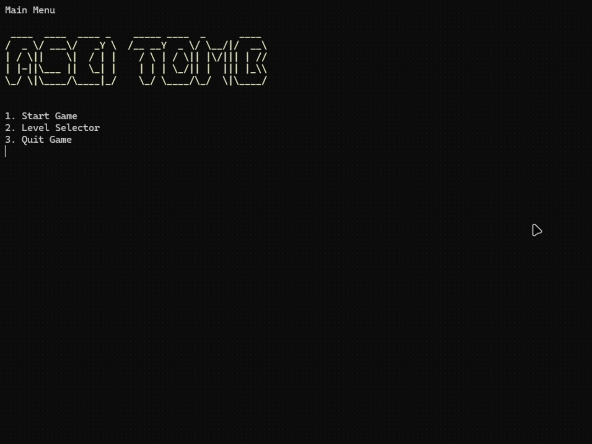

# AsciiTomb

**AsciiTomb** is a console game written in C#, where the player moves a character across an ASCII-based map, clearing all empty cells to complete levels. It is inspired by the mobile game **Tomb of the Mask**.



---

## Technologies
- **C# (.NET 6+)** — main programming language  
- **System.Console** — rendering and input handling  
- **System.IO** — file save system  
- **System.Threading.Tasks** — animations and delays  

---

## Controls
- **W / A / S / D** — move the player  
- **R** — restart current level  
- **Q** — return to main menu  

---

## Installation & Run

### Requirements
- [.NET SDK 6.0+](https://dotnet.microsoft.com/download)

### Steps
```bash
git clone https://github.com/maksimsavicev/AsciiTomb.git
cd AsciiTomb
dotnet build
dotnet run
